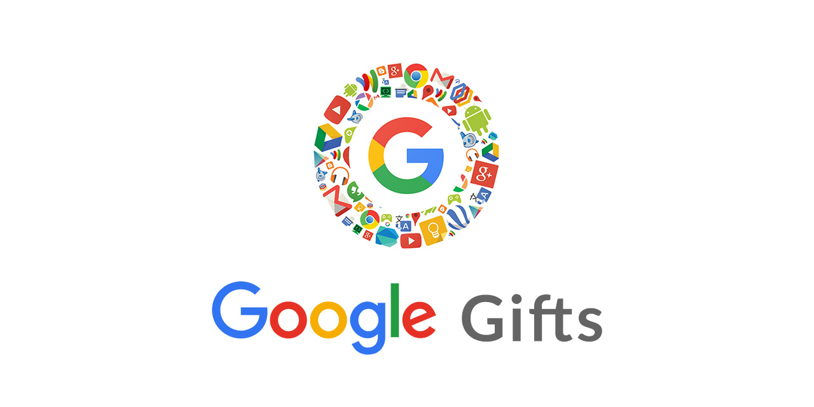

  

  

#### Contributing

I'd love your help improving this repo. If interested in contributing a pull request, please:

1. Make sure your PR has a valid title and description. 
2. Your PR updates only touch the parts of the repo it needs to. In most cases this will be `contributing.md`.

If updating an opinion or recommendation in the book, please help us by providing data to back the change. This helps equip us with tools to make the best call on such updates.

## License

Except as otherwise noted, the content of this book is licensed under the  Creative Commons [Attribution-NonCommercial-NoDerivs 2.0 Generic (CC BY-NC-ND 2.0)](https://creativecommons.org/licenses/by-nc-nd/2.0/) license.

