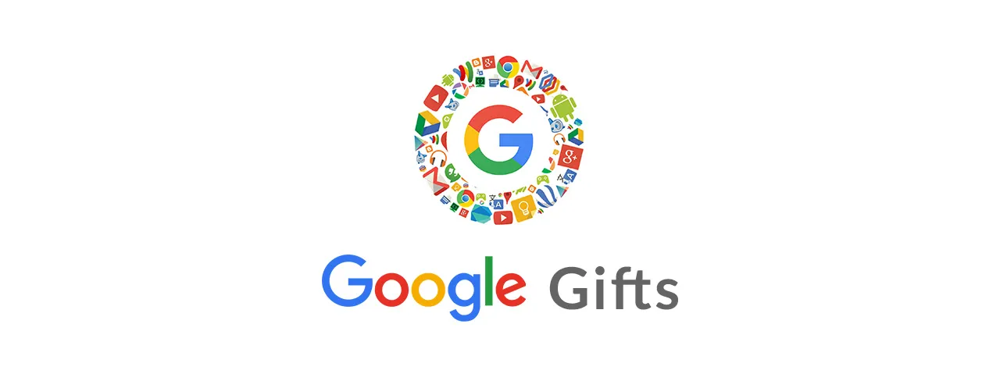

  

## Contributing

I'd love your help improving this repo. If interested in contributing a pull request, please:

1. Make sure your PR has a valid title and description. 
2. Your PR updates only touch the parts of the repo it needs to. In most cases this will be `contributing.md`.

If updating an opinion or recommendation in the repo, please help us by providing data to back the change. This helps equip us with tools to make the best call on such updates.

## Table of contents

- [Google Developers](https://developers.google.com/)
- [Think with Google](https://www.thinkwithgoogle.com/)
- [Google Design](https://design.google/)
- [Google AI](https://ai.google/)
- [Google Cloud Platform](https://cloud.google.com/)
- [Google open source](https://opensource.google.com/)
- [Google Apps Script](https://www.google.com/script/start/)
- [Google DeepMind](https://deepmind.com/)
- [Made with Code](https://www.madewithcode.com/)
- [Google Tech Dev Guide](https://techdevguide.withgoogle.com/)
- [Google for Education](https://edu.google.com/)
- [Google Developers Training](https://developers.google.com/training/)
- [Google for Startups](https://startup.google.com/)
- [Talks at Google](https://talksat.withgoogle.com/)
- [Google Developers Blog](https://developers.googleblog.com/)
- [Google Protocol Buffers](https://developers.google.com/protocol-buffers/)
- [Google Codelabs](https://codelabs.developers.google.com/)
- [Grow With Google](https://grow.google/)
- [Google My Business](https://www.google.com/business/)
- [Google Earth](https://www.google.com/earth/)
- [Google Scholar](https://scholar.google.co.in/)
- [Google Digital Garage](https://learndigital.withgoogle.com/)
- [Google Summer of Code](https://summerofcode.withgoogle.com/)
- [Google Trends](https://trends.google.com/trends/)
- [Google User Experience Research](https://userresearch.google.com/)
- [Experiments with Google](https://experiments.withgoogle.com/)
- [Google API](https://developers.google.com/apis-explorer/)
- [Web.dev](https://web.dev/)
- [Google Arts and Culture](https://artsandculture.google.com/)
- [Google Careers](https://careers.google.com/)
- [Google Sites](https://sites.google.com/)
- [Google Product Experts](https://productexperts.withgoogle.com/)
- [Google Alerts](https://www.google.co.in/alerts/)
- [Google Marketing Platform](https://marketingplatform.google.com/)
- [Google Data Studio](https://datastudio.google.com/)
- [Google Web Platform](https://webplatform.github.io/)
- [Google Code-in](https://codein.withgoogle.com/)
- [Google Accessibility](https://www.google.com/accessibility/)
- [Google Analytics](https://analytics.google.com/analytics/web/)
- [Google AR / VR](https://arvr.google.com/)
- [Google Stadia](https://stadia.dev/)
- [Google Waze](https://developers.google.com/waze/)
- [Season of Docs](https://developers.google.com/season-of-docs/)
- [Build your future](https://buildyourfuture.withgoogle.com/)
- [Google's Coding Competitions](https://codingcompetitions.withgoogle.com/)
- [Google for Nonprofits](https://www.google.com/nonprofits/)
- [Google Research](https://research.google/)
- [Google Sustainability](https://sustainability.google/)
- [AMP](https://amp.dev/)
- [Firebase](https://firebase.google.com/)
- [Flutter](https://flutter.dev/)
- [Google Doodles](https://www.google.com/doodles)
- [Google Translate](https://translate.google.com/)
- [Google Trips](https://www.google.com/travel/)
- [Google News](https://news.google.com/)
- [Google Calendar](https://www.google.com/calendar/)
- [Google Chat](https://mail.google.com/chat/)
- [Google Meet](https://meet.google.com/)
- [Google Docs Editors](https://www.google.com/docs/about/)
- [Google Drive](https://drive.google.com/)
- [Google Keep](https://www.google.com/keep/)
- [Next Yours](#)

## License

Except as otherwise noted, the content of this repo is licensed under the  Creative Commons [Creative Commons Attribution 4.0 International License.
](http://creativecommons.org/licenses/by/4.0/) license.
